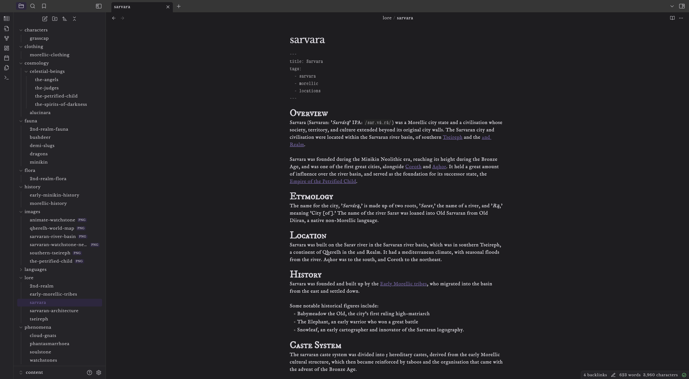

## Autumn Thoughts
Autumn Thoughts is an Obsidian theme created by Mylo / Ana Hodges. It's my first time creating one so be nice!

## Design Philosophy
My design philosophy behind this theme is just to give my notes a more refined, tasteful, and fantasy-esque feel. I.e. using more old fashioned fonts, with lots of serifs, and cool colours.

Furthermore, I wanted to give autumn thoughts a feeling of customisability, so the accent colour chosen in Obsidian also controls the overall colour of the theme.

Copyright Mylo Hodges © 2024